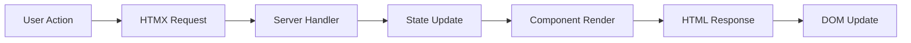

# State Management

Learn how to effectively manage state in FastComponents applications, from simple component state to complex application-wide state patterns.

## Understanding State

### What is State?

In FastComponents, state represents the data that:
- Determines what a component displays
- Changes over time based on user interactions
- Can be serialized to/from query strings
- Is immutable (using C# records)

### State Flow



## Component State Basics

### Defining State

Use records that inherit from `HtmxComponentParameters`:

```C#
[GenerateParameterMethods]
public partial record TodoListState : HtmxComponentParameters
{
    public List<TodoItem> Items { get; init; } = [];
    public string Filter { get; init; } = "all";
    public string SortBy { get; init; } = "created";
}

public record TodoItem
{
    public int Id { get; init; }
    public string Text { get; init; } = "";
    public bool IsCompleted { get; init; }
    public DateTime CreatedAt { get; init; }
}
```

### State Immutability

Always create new state instances instead of modifying existing ones:

```C#
// ❌ Wrong - Modifying state
State.Items.Add(newItem);

// ✅ Correct - Creating new state
State = State with 
{ 
    Items = State.Items.Concat([newItem]).ToList() 
};
```

### State Initialization

Initialize state in different ways:

```Razor
@inherits SimpleHtmxComponent<ProductListState>

@code {
    // Option 1: Default values in record
    public record ProductListState : HtmxComponentParameters
    {
        public int Page { get; init; } = 1;
        public int PageSize { get; init; } = 20;
    }
    
    // Option 2: Override CreateDefaultParameters
    protected override ProductListState CreateDefaultParameters()
    {
        return new ProductListState
        {
            Page = 1,
            PageSize = GetUserPreference("pageSize") ?? 20
        };
    }
    
    // Option 3: Initialize in OnInitialized
    protected override void OnInitialized()
    {
        if (State.Products.Count == 0)
        {
            State = State with { Products = LoadInitialProducts() };
        }
    }
}
```

## URL State Management

### Query String Serialization

The `[GenerateParameterMethods]` attribute generates methods for URL state:

```C#
[GenerateParameterMethods]
public partial record SearchState : HtmxComponentParameters
{
    public string Query { get; init; } = "";
    public int Page { get; init; } = 1;
    public string Category { get; init; } = "all";
}

// Generated methods:
// - BuildQueryString() => "query=shoes&page=2&category=footwear"
// - BindFromQuery(IQueryCollection) => new SearchState { ... }
```

### Controlling Serialization

Use `SkipDefaults` to exclude default values:

```C#
[GenerateParameterMethods(SkipDefaults = true)]
public partial record FilterState : HtmxComponentParameters
{
    public string Status { get; init; } = "active"; // Won't appear in URL if "active"
    public int MinPrice { get; init; } = 0; // Won't appear if 0
}
```

### Manual URL State

For complex scenarios, implement custom serialization:

```C#
public record ComplexState : HtmxComponentParameters
{
    public List<int> SelectedIds { get; init; } = [];
    public Dictionary<string, string> Filters { get; init; } = new();
    
    protected override string BuildQueryString()
    {
        var parts = new List<string>();
        
        // Custom serialization for lists
        if (SelectedIds.Any())
        {
            parts.Add($"ids={string.Join(",", SelectedIds)}");
        }
        
        // Custom serialization for dictionaries
        foreach (var (key, value) in Filters)
        {
            parts.Add($"filter_{key}={Uri.EscapeDataString(value)}");
        }
        
        return string.Join("&", parts);
    }
    
    public override HtmxComponentParameters BindFromQuery(IQueryCollection query)
    {
        var ids = query["ids"].ToString()
            .Split(',', StringSplitOptions.RemoveEmptyEntries)
            .Select(int.Parse)
            .ToList();
            
        var filters = query
            .Where(q => q.Key.StartsWith("filter_"))
            .ToDictionary(
                q => q.Key[7..], 
                q => q.Value.ToString()
            );
            
        return this with { SelectedIds = ids, Filters = filters };
    }
}
```

## Complex State Patterns

### Nested State

Organize complex state with nested records:

```C#
public record AppState : HtmxComponentParameters
{
    public UserState User { get; init; } = new();
    public CartState Cart { get; init; } = new();
    public UIState UI { get; init; } = new();
}

public record UserState
{
    public int Id { get; init; }
    public string Name { get; init; } = "";
    public bool IsAuthenticated { get; init; }
}

public record CartState
{
    public List<CartItem> Items { get; init; } = [];
    public decimal Total => Items.Sum(i => i.Price * i.Quantity);
}

public record UIState
{
    public bool IsSidebarOpen { get; init; }
    public string Theme { get; init; } = "light";
    public string ActiveModal { get; init; } = "";
}
```

### State Composition

Compose state from multiple sources:

```Razor
@inherits SimpleHtmxComponent<DashboardState>
@inject IUserService UserService
@inject IStatsService StatsService

@code {
    protected override async Task OnInitializedAsync()
    {
        // Compose state from multiple services
        var user = await UserService.GetCurrentUserAsync();
        var stats = await StatsService.GetUserStatsAsync(user.Id);
        
        State = new DashboardState
        {
            UserName = user.Name,
            TotalOrders = stats.OrderCount,
            Revenue = stats.TotalRevenue,
            RecentActivity = stats.RecentActivity
        };
    }
}
```

### State Reducers

Implement reducer pattern for complex state updates:

```C#
public static class TodoReducers
{
    public static TodoState Reduce(TodoState state, TodoAction action)
    {
        return action switch
        {
            AddTodoAction add => state with
            {
                Items = state.Items.Append(new TodoItem
                {
                    Id = state.NextId,
                    Text = add.Text,
                    CreatedAt = DateTime.Now
                }).ToList(),
                NextId = state.NextId + 1
            },
            
            ToggleTodoAction toggle => state with
            {
                Items = state.Items.Select(item =>
                    item.Id == toggle.Id
                        ? item with { IsCompleted = !item.IsCompleted }
                        : item
                ).ToList()
            },
            
            DeleteTodoAction delete => state with
            {
                Items = state.Items.Where(i => i.Id != delete.Id).ToList()
            },
            
            FilterTodoAction filter => state with
            {
                Filter = filter.FilterType
            },
            
            _ => state
        };
    }
}

// Usage in component
protected override TodoState OnPost(TodoState state)
{
    var action = ParseAction(Request.Form);
    return TodoReducers.Reduce(state, action);
}
```

## Server-Side State

### Session State

Store user-specific state in sessions:

```C#
public class CartComponent : SimpleHtmxComponent<CartState>
{
    [Inject] private IHttpContextAccessor HttpContextAccessor { get; set; } = null!;
    
    protected override async Task OnInitializedAsync()
    {
        var session = HttpContextAccessor.HttpContext?.Session;
        
        // Load cart from session
        var cartJson = session?.GetString("cart");
        if (!string.IsNullOrEmpty(cartJson))
        {
            State = JsonSerializer.Deserialize<CartState>(cartJson)!;
        }
    }
    
    protected override CartState OnPost(CartState state)
    {
        // Update state
        var newState = UpdateCart(state);
        
        // Save to session
        var session = HttpContextAccessor.HttpContext?.Session;
        session?.SetString("cart", JsonSerializer.Serialize(newState));
        
        return newState;
    }
}
```

### Database State

Persist state to database:

```C#
public class UserPreferencesComponent : SimpleHtmxComponent<PreferencesState>
{
    [Inject] private IDbContext DbContext { get; set; } = null!;
    [Inject] private ICurrentUser CurrentUser { get; set; } = null!;
    
    protected override async Task OnInitializedAsync()
    {
        var userId = CurrentUser.Id;
        var prefs = await DbContext.UserPreferences
            .FirstOrDefaultAsync(p => p.UserId == userId);
            
        if (prefs != null)
        {
            State = new PreferencesState
            {
                Theme = prefs.Theme,
                Language = prefs.Language,
                PageSize = prefs.PageSize
            };
        }
    }
    
    protected override async Task<PreferencesState> OnPostAsync(PreferencesState state)
    {
        // Save to database
        var prefs = await DbContext.UserPreferences
            .FirstOrDefaultAsync(p => p.UserId == CurrentUser.Id);
            
        if (prefs == null)
        {
            prefs = new UserPreferences { UserId = CurrentUser.Id };
            DbContext.UserPreferences.Add(prefs);
        }
        
        prefs.Theme = state.Theme;
        prefs.Language = state.Language;
        prefs.PageSize = state.PageSize;
        
        await DbContext.SaveChangesAsync();
        
        return state;
    }
}
```

### Distributed State

Share state across servers using cache:

```C#
public class LiveDashboard : SimpleHtmxComponent<DashboardState>
{
    [Inject] private IDistributedCache Cache { get; set; } = null!;
    
    protected override async Task OnInitializedAsync()
    {
        var cacheKey = "dashboard:global";
        var cached = await Cache.GetStringAsync(cacheKey);
        
        if (!string.IsNullOrEmpty(cached))
        {
            State = JsonSerializer.Deserialize<DashboardState>(cached)!;
        }
        else
        {
            State = await BuildDashboardStateAsync();
            await Cache.SetStringAsync(
                cacheKey, 
                JsonSerializer.Serialize(State),
                new DistributedCacheEntryOptions
                {
                    SlidingExpiration = TimeSpan.FromMinutes(5)
                });
        }
    }
}
```

## State Synchronization

### Cross-Component Communication

Use events to synchronize state between components:

```C#
// Shared event service
public class StateEventService
{
    public event EventHandler<CartUpdatedEventArgs>? CartUpdated;
    
    public void NotifyCartUpdate(CartState newState)
    {
        CartUpdated?.Invoke(this, new CartUpdatedEventArgs(newState));
    }
}

// Cart component
public class CartComponent : SimpleHtmxComponent<CartState>
{
    [Inject] private StateEventService Events { get; set; } = null!;
    
    protected override CartState OnPost(CartState state)
    {
        var newState = UpdateCart(state);
        Events.NotifyCartUpdate(newState);
        return newState;
    }
}

// Header component showing cart count
public class HeaderComponent : SimpleHtmxComponent<HeaderState>
{
    [Inject] private StateEventService Events { get; set; } = null!;
    
    protected override void OnInitialized()
    {
        Events.CartUpdated += OnCartUpdated;
    }
    
    private void OnCartUpdated(object? sender, CartUpdatedEventArgs e)
    {
        State = State with { CartItemCount = e.CartState.Items.Count };
        // Trigger re-render via response header
        HttpContext.GetHtmxResponseHeaders()
            .Trigger("cart-updated");
    }
}
```

### Real-Time State Updates

Use SSE or WebSockets for real-time updates:

```Razor
@* Real-time notifications component *@
<div hx-ext="sse" sse-connect="/notifications/stream">
    <div id="notification-list" 
         sse-swap="notification">
        @foreach (var notification in State.Notifications)
        {
            <div class="notification">@notification.Message</div>
        }
    </div>
</div>

@* Server-side SSE endpoint *@
app.MapGet("/notifications/stream", async (HttpContext context) =>
{
    context.Response.Headers.Append("Content-Type", "text/event-stream");
    
    while (!context.RequestAborted.IsCancellationRequested)
    {
        var notification = await GetNextNotificationAsync();
        if (notification != null)
        {
            var html = RenderNotification(notification);
            await context.Response.WriteAsync($"event: notification\n");
            await context.Response.WriteAsync($"data: {html}\n\n");
            await context.Response.Body.FlushAsync();
        }
        
        await Task.Delay(1000);
    }
});
```

## State Validation

### Client-Side Validation

Use HTMX validation attributes:

```Razor
<form hx-post="@Url" hx-validate="true">
    <input type="email" name="email" required />
    <input type="number" name="age" min="18" max="100" />
    <button type="submit">Submit</button>
</form>
```

### Server-Side Validation

Validate state on the server:

```C#
public record RegistrationState : HtmxComponentParameters, IValidatableObject
{
    public string Email { get; init; } = "";
    public string Password { get; init; } = "";
    public string ConfirmPassword { get; init; } = "";
    
    public IEnumerable<ValidationResult> Validate(ValidationContext context)
    {
        if (!IsValidEmail(Email))
            yield return new ValidationResult("Invalid email", [nameof(Email)]);
            
        if (Password.Length < 8)
            yield return new ValidationResult("Password too short", [nameof(Password)]);
            
        if (Password != ConfirmPassword)
            yield return new ValidationResult("Passwords don't match", [nameof(ConfirmPassword)]);
    }
}

// In component
protected override RegistrationState OnPost(RegistrationState state)
{
    var validationResults = new List<ValidationResult>();
    var isValid = Validator.TryValidateObject(
        state, 
        new ValidationContext(state), 
        validationResults, 
        true);
        
    if (!isValid)
    {
        return state with { Errors = validationResults };
    }
    
    // Process valid state...
}
```

## Performance Considerations

### State Size

Keep state minimal:

```C#
// ❌ Don't store derived values
public record BadState : HtmxComponentParameters
{
    public List<Product> Products { get; init; } = [];
    public decimal TotalPrice { get; init; } // Can be calculated
    public int ProductCount { get; init; } // Can be derived
}

// ✅ Calculate derived values
public record GoodState : HtmxComponentParameters
{
    public List<Product> Products { get; init; } = [];
    public decimal TotalPrice => Products.Sum(p => p.Price);
    public int ProductCount => Products.Count;
}
```

### Lazy Loading

Load expensive data on demand:

```C#
public record DashboardState : HtmxComponentParameters
{
    public bool IsStatsLoaded { get; init; }
    public DashboardStats? Stats { get; init; }
}

// Component
<div class="stats-panel">
    @if (!State.IsStatsLoaded)
    {
        <div hx-get="@Url?loadStats=true" 
             hx-trigger="revealed"
             hx-swap="outerHTML">
            Loading stats...
        </div>
    }
    else
    {
        <StatsDisplay Stats="@State.Stats" />
    }
</div>
```

## Best Practices

1. **Immutability**: Always use immutable state with C# records
2. **Minimize State**: Only store essential data
3. **URL State**: Use URL state for shareable views
4. **Validation**: Validate both client and server side
5. **Performance**: Consider state size and serialization cost
6. **Testing**: State should be easily testable
7. **Documentation**: Document complex state structures

## Next Steps

- [Performance](Performance.md) - Optimization techniques
- [Testing](Testing.md) - Testing state management
- [Advanced Features](Advanced-Features.md) - Complex patterns
- [Troubleshooting](Troubleshooting.md) - Common issues